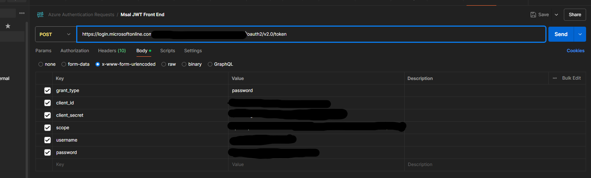
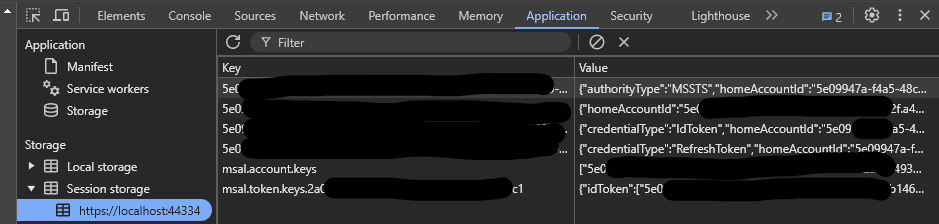

# Msal testing project
This app is meant to load a token call from `https://login.microsoftonline.com/your-tenantId/oauth2/v2.0/token` into the sessionStorage and then use Msal `loadExternalTokens` and have no redirect from the MS login page pop up. 

The motivation is that way the selenium runner can get the tokens and load them into session storage to then run E2E tests with specific users. 

There is an authenticated page that should get redirected to after the set sessionStorage button on the homepage is clicked, or a user clicks the link `Login with a page redirect`. The link is meant to test that the app reg is set up correctly, and the session storage is used to show that loadExternalTokens is working. However this is where the issue seems to happen. That will not redirect silently and will pop up a login prompt which is not the expected outcome.

This seems to not work on 2.2 or 3.0 versions of msal when testing the `loadExternalTokens` method.

# Prerequisites
## App Registration and Client ID

To set up app registration and client ID, follow these steps:

1. **Register the application in Azure AD**:
    - Go to the Azure portal.
    - Navigate to "Azure Active Directory" > "App registrations" > "New registration".
    - Enter a name for the application.
    - Set the redirect URI to `https://localhost:3000` for local development using the SPA configuration.
    - Click "Register".

3. **Create a client secret**:
    - Go to "Certificates & secrets".
    - Click "New client secret" and add a description.
    - Set the expiration period and click "Add".
    - Copy the client secret value and store it securely.

4. **Update the `.env` file**:
    - Update `VITE_CLIENT_ID`, `VITE_CLIENT_SECRET`, `VITE_TENANT_ID`, and `VITE_REDIRECT_URI` to match what was put in the app reg.


By following these steps, you will have successfully registered your application and configured the client ID in your project.

## Certificates

To get certificates, you have the following commands.

1. install chocolatey
2. then, the actual certificate library, 'choco install mkcert' `do this from admin`
3. run `mkcert -install` to install the root certificate
4. now run the following to create the actual certificates.


Run these commands from the `MSAL-TEST-PROJ` folder.
```bash
//creates a certificate folder
mkdir -p .cert
//creates the actual certificates in the folder 
mkcert -key-file ./.cert/key.pem -cert-file ./.cert/cert.pem "localhost"

```
a new .cert folder should be next to the .vscode folder under the `MSAL-TEST-PROJ` folder.


then run `npm install` to install the dependencies in the same folder.

# Running the App

run `npm run dev` to start the app or `f5` to debug in the browser if using vscode. (The project will need to be opened from the MSAL-TEST-PROJ folder for this step).


make sure you have a call to get a bearer token in postman 
Something to this effect 


make sure your scope has these values `openid profile offline_access your-clientId/User.Read` where you'd replace `your-clientId` with your client id from your app registration. 

Once you get your bearer token, it should be in a format like this 

```json 
{"token_type":"Bearer","scope":"your-clientId/User.Read","expires_in":4190,"ext_expires_in":4190,"access_token":"ey...","refresh_token":"...","id_token":"ey..."}
```

Then you can paste the whole raw string into the `Set bearer token in sessionStorage` on the homepage. 
Once that is set the rest and you click the button you should get navigated to the `authed page` with a silent login using the session storage via the loadExternalTokens method. However this is popping up a redirect with a login prompt.

However that doesn't appear to be working and this page will appear even tho `loadExternalTokens` is being called and previously once that was set `acquireTokenSilent` would get called using the new sessionStorage items that msal loads. These values appear to be in the browser, but we still are haunted by the login page prompt. Judging by [this](https://github.com/AzureAD/microsoft-authentication-library-for-js/blob/dev/lib/msal-browser/docs/testing.md) testing doc this should be set up correctly

Here is what the app session storage looks like after `loadExternalTokens` is called 




## things tried to get this to work
Also tried to use one instance of the msal object and that didn't work either. 
```javascript
    await msalInstance.initialize();
    await msalInstance.handleRedirectPromise();
    const authenticationResult = await msalInstance.getTokenCache().loadExternalTokens(silentRequest, serverResponse, loadTokenOptions);

    console.log(JSON.stringify(authenticationResult));
```

also tried to call the `acquireToken` function after selenium tokens are set and manually would set the `instance.setActiveAccount(silentRequest.account)` with no effect. 
